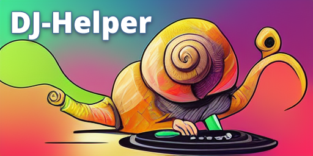

    
    
DJ-Helper is a free Discord music bot written in python.

     
    
The stable release of this can be found at <a href="https://github.com/BeeLazy/DJ-Helper/releases">github.com</a>

     
    
    
    
    

## Features
- Easy to use
- Good sound quality
- Sound filters
- Supports free text search as well as links
- Streams music from:
    - Youtube
    - More to come
- Converts any stream to MP3 link
- Autoplay
- Playlists
- Request system
- Totally free. No nagging. No voting.
- Open source. Always. Forever.

## Installation
See the [documentation](docs/HowToInstall.md)

## Contributing
To contribute to DJ-Helper development, start with making a fork of the repository. Do the changes in your fork, and make a pull request when you are happy with them.

We use a loose version of [GitLab Flow](https://docs.gitlab.com/ee/topics/gitlab_flow.html). Most importantly, everything starts with an issue or discussion.

## Roadmap
The main goal of this project is to make a very userfriendly bot. Users should be able to operate it at all stages of a real party!

It should have great playlist system. The bot should be able to automatically generate playlists from Youtube, Spotify and other popular streamingservices' playlists, so the users dont have to do redo their playlists.

It should be stable, and have good sound quality. Nothing poops on the party as a DJ struggeling to get sound in the speakers. The sound should be adjustable with normal soundfilters.

Offer MP3 conversions of everything that the bot can stream.

The roadmap is to:
- Finish the basic player
- Integrate with dropbox for large file support
- Add soundfilters

## Authors and acknowledgment
[BeeLazy](https://t.me/BeeLazy)

## Licences

DJ-Helper, Wavelink, Lavalink, discord.py, 
dropbox-sdk-python is licensed under the MIT license.

youtube-dl, yt-dlp is licensed under the Unlicense license.

## Project status
The project is currently under development.

## Resources
[How to install DJ-Helper](docs/HowToInstall.md) - 
[DJ-Helper sourcecode](https://github.com/BeeLazy/DJ-Helper)

[WaveLink documentation](https://wavelink.readthedocs.io/en/latest/) - 
[WaveLink sourcecode](https://github.com/PythonistaGuild/Wavelink)

[Lavalink documentation](https://lavalink.readthedocs.io/en/master/) - 
[Lavalink sourcecode](https://github.com/freyacodes/Lavalink)

[discord.py documentation](https://discordpy.readthedocs.io/en/stable/) - 
[discord.py sourcecode](https://github.com/Rapptz/discord.py)

[youtube-dl documentation](https://github.com/ytdl-org/youtube-dl/blob/master/README.md) - 
[youtube-dl sourcecode](https://github.com/ytdl-org/youtube-dl)

[dropbox-sdk-python documentation](https://dropbox-sdk-python.readthedocs.io/en/latest/) - 
[dropbox-sdk-python sourcecode](https://github.com/dropbox/dropbox-sdk-python)